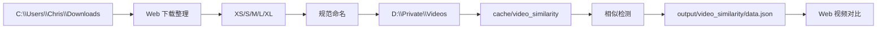

# 架构说明

## 定位

`DownloadVideoProcessor` 是一个本地视频下载后处理工作台。项目只保存代码、配置、缓存、报告和日志；视频实体仍放在外部目录：

- 下载区：`C:\Users\Chris\Downloads`
- 视频库：`D:\Private\Videos`

## 数据分区

下载区使用短目录名：

- `XS`：0-10 MB
- `S`：10-20 MB
- `M`：20-40 MB
- `L`：40-200 MB
- `XL`：200 MB+

视频库使用带序号和范围的目录：

- `0_XS(0MB_10MB)`
- `1_S(10MB_20MB)`
- `2_M(20MB_40MB)`
- `3_L(40MB_200MB)`
- `4_XL(200MB_INF)`

两者映射定义在 `config/video_processor.json`。

## 核心模块

`scripts/run_similarity.py`

- 当前唯一保留的脚本入口。
- 支持相似度扫描、增量扫描、缓存统计、孤立缓存清理和 Web 服务启动。
- 默认读取 `config/video_processor.json` 中的扫描目录、缓存目录、输出目录和相似检测参数。
- 不再支持旧的 `operation.md --prune` 删除流程。

`utils/video_similarity/checker.py`

- 协调视频扫描、特征提取、缓存读取和相似度计算。
- 支持增量模式：新增视频只与已有库对比，避免全库两两比较。

`utils/video_similarity/extractor.py`

- 使用 OpenCV 抽取采样帧。
- 计算 pHash、dHash、颜色直方图、时长、分辨率等特征。

`utils/video_similarity/cache.py`

- 将视频特征写入 `config/video_processor.json` 中配置的 `cache_dir`。
- 缓存文件名基于视频路径和内容信息生成。

`utils/video_similarity/reporter.py`

- 生成 Web 所需的 `data.json` 和 `index.html`。
- 旧版 `operation.md` 决策文件已移除。

`utils/video_similarity/server.py`

- 本地 HTTP 服务。
- 支持视频流式预览、相似对忽略、真实删除、资源管理器打开。
- 支持相似比对后台任务：下载区增量比对、视频库全量重新扫描。
- 支持孤立特征缓存预览和清理。
- 支持下载整理 API：状态汇总、按大小分类、按创建时间规范命名、迁移入库并写入特征缓存。
- 支持视频库概览 API：规格数量、容量占比、大小分布。

## 当前数据流

## 运行产物

`cache/video_similarity`

- 保存视频特征缓存。
- 可删除后重建，但重建会显著增加下次扫描耗时。

`output/video_similarity`

- `data.json`：Web 相似对数据。
- `index.html`：Web 工作台页面。
- `dismissed.json`：已忽略的相似对。
- `server.log`：服务端异常日志。

`logs`

- 历史运行日志。
- 不参与当前主流程判定。

## 风险边界

- Web `删除此视频` 会真实删除本地视频文件。
- Web `一键分类` 会移动下载根目录中的视频。
- Web `一键规范命名` 会重命名已分类目录中的视频。
- Web `一键迁移并缓存` 会移动视频到视频库，并写入特征缓存。
- Web `清理孤立缓存` 只删除特征缓存文件，不删除视频文件。
- 文件很多时，迁移和特征提取会耗时较久；当前接口是同步长请求，完成后一次性返回结果。
- 全库重新扫描会按 `n * (n - 1) / 2` 生成比对任务，视频库较大时耗时明显。
