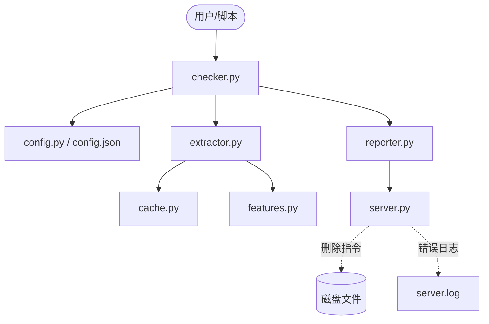

# 视频相似性工具项目结构描述 (DESCRIPTION.md)

本目录 `utils/video_similarity` 包含了一套完整的视频相似度检测与处理工具集。该工具采用多特征融合（pHash, dHash, 颜色直方图, 时长）策略，实现了高性能的视频比对与交互式清理功能。

## 1. 目录结构概览

```text
utils/video_similarity/
├── __init__.py          # 模块入口，对外暴露核心 API
├── config.py            # 配置管理类 (SimilarityConfig)，负责加载 config.json
├── config.json          # 核心配置文件，包含权重、阈值、采样频率等
├── features.py          # 特征数据结构 (VideoFeatures)，定义视频指纹模型
├── cache.py             # 缓存管理器 (FeatureCache)，实现特征数据的持久化
├── extractor.py         # 特征提取引擎 (VideoFeatureExtractor)，执行图像处理逻辑
├── checker.py           # 核心业务逻辑 (VideoSimilarityChecker)，协调比对与搜寻
├── reporter.py          # 报告生成器 (VideoSimilarityReporter)，加载模板并注入元数据
├── server.py            # 交互服务 (SimilarityReportHandler)，基于 ArtPlayer 提供双屏对比
├── templates/           # 包含 HTML 报告模板
│   └── report_template.html
├── utils.py             # 通用工具函数，如时长与文件大小格式化
├── README.md            # 项目主说明文档 & 使用指南
└── server.log           # 服务端运行日志 (由 server.py 自动生成)
```

## 2. 文件功能详述

- **`checker.py`**: 
  - **核心类**: `VideoSimilarityChecker`
  - **功能**: 作为系统的中央处理器。它封装了并行扫描目录、提取视频指纹、计算相似度得分以及导出最终报告的高层逻辑。
  
- **`extractor.py`**:
  - **核心类**: `VideoFeatureExtractor`
  - **功能**: 使用 OpenCV 和 imagehash 库从视频中均匀采样关键帧，并转换为数字指纹（pHash/dHash/颜色直方图）。

- **`features.py`**:
  - **核心类**: `VideoFeatures`
  - **功能**: 统一的指纹数据容器，确保在提取、缓存和比对各个阶段数据格式的一致性。

- **`cache.py`**:
  - **核心类**: `FeatureCache`
  - **功能**: 管理位于 `cache/video_similarity/` 的 JSON 缓存。通过文件内容哈希进行命名，支持多进程读写，显著提升二次扫描的速度。

- **`reporter.py`**:
  - **核心类**: `VideoSimilarityReporter`
  - **功能**: 
    - 负责从 `templates/report_template.html` 加载交互式报告模板。
    - 将对比结果 (JSON) 注入模板，生成包含完整 UI 逻辑的 `index.html`。

- **`server.py`**:
  - **核心类**: `SimilarityReportHandler`
  - **功能**: 启动一个增强的 Web 服务器，核心特性包括：
    - **双屏同步对比**: 集成 **ArtPlayer**，支持 V3.2 高级同步算法（播放/暂停/跳进度/倍速）。
    - **全屏对齐**: 针对原生及网页全屏优化，退出全屏时自动强制对齐进度。
    - **文件定位**: 提供“在文件夹中显示”按钮，一键打开资源管理器并选中文件。
    - **流式传输**: 支持 HTTP Range 请求，实现秒开预览和自由拖拽。
    - **均保留缓存**: 用户选择"均保留"的视频对会持久化到 `dismissed.json`，重启后不再重复出现。
    - **健壮性**: 内置 ConnectionAborted 保护，并将所有错误堆栈持久化到 `server.log`。

- **`config.py` & `config.json`**:
  - **功能**: 定义算法参数。用户可以通过修改 `config.json` 动态调整不同特征（如 pHash 或颜色）在评分中的占比，以及相似度的判定阈值。

## 3. 文件关联性与工作流



1.  **配置加载**: `Checker` 读取 `Config` 初始化环境。
2.  **特征生命周期**: `Checker` 调用 `Extractor` 获取视频特征。`Extractor` 优先查询 `Cache`，若无记录则执行实际提取并存回 `Cache`。
3.  **相似度比对**: `Checker` 在内存中利用 `VideoFeatures` 数据计算加权总分。
4.  **结果输出**: `Checker` 调用 `Reporter` 将结果固化为 MD/JSON/HTML。
5.  **交互处理**: 用户运行 `server.py` 加载 `Reporter` 生成的数据进行可视化确认，并执行文件下架操作。

## 4. 增量检测模式

支持将**新增视频**与**已有视频库**进行比对，而非全量两两比对。

**使用场景**：用户有一个已整理的视频库，新下载了一批视频，只需确认新视频与已有库是否重复。

**命令行用法**：
```bash
python scripts/run_similarity.py -d <已有库1> <已有库2> -i <新增目录>
```

**配置文件用法** (`config.json`)：
```json
{
    "base_dirs": ["D:/Videos/Library"],
    "incremental_dirs": ["D:/Downloads/NewVideos"]
}
```

**缓存策略**：
- 已有库视频：使用缓存
- 新增视频：**不缓存特征**（待用户确认后移动到库时才会生成缓存）
