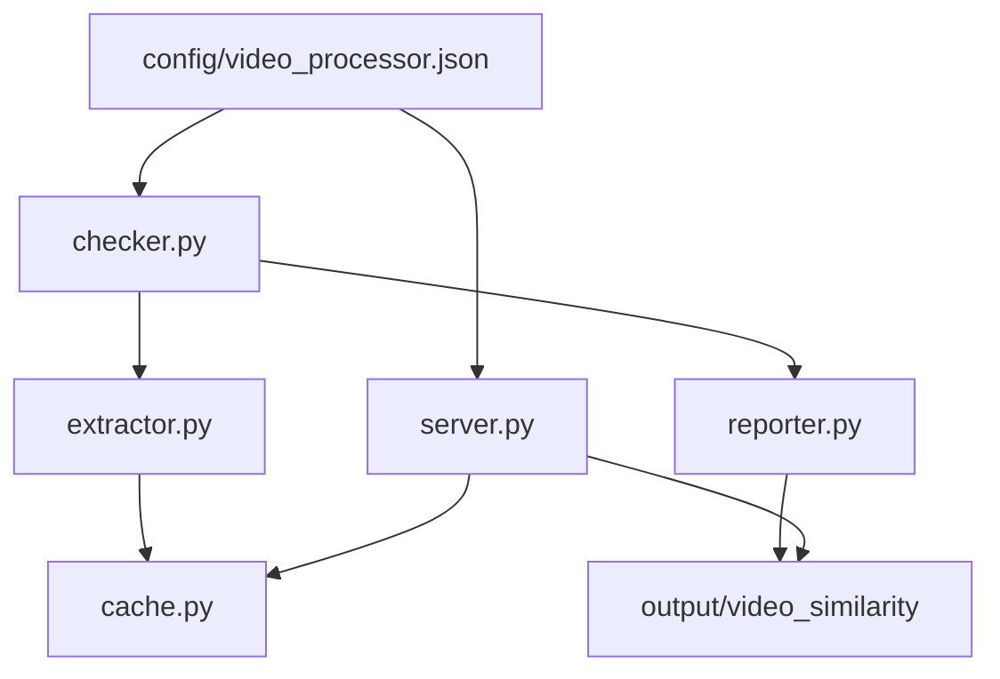

# video_similarity 模块结构

`utils/video_similarity` 包含当前项目的视频相似检测与 Web 工作台核心逻辑。

```text
utils/video_similarity/
├── __init__.py
├── config.py
├── features.py
├── cache.py
├── extractor.py
├── checker.py
├── reporter.py
├── server.py
├── templates/
│   └── report_template.html
└── utils.py
```

## 职责

- `config.py`：读取 `config/video_processor.json`，并把统一配置转换为相似检测运行配置。
- `features.py`：定义视频特征数据结构。
- `cache.py`：读写特征缓存 JSON。
- `extractor.py`：从视频中抽帧并提取感知哈希、差异哈希、颜色直方图和基础元数据。
- `checker.py`：收集视频、提取特征、计算相似度和生成报告。
- `reporter.py`：生成 Web 报告数据和 HTML。
- `server.py`：提供本地 Web 服务，包含视频流式预览、相似组忽略、真实删除、下载整理、迁移入库和特征缓存写入接口。

## 数据流


